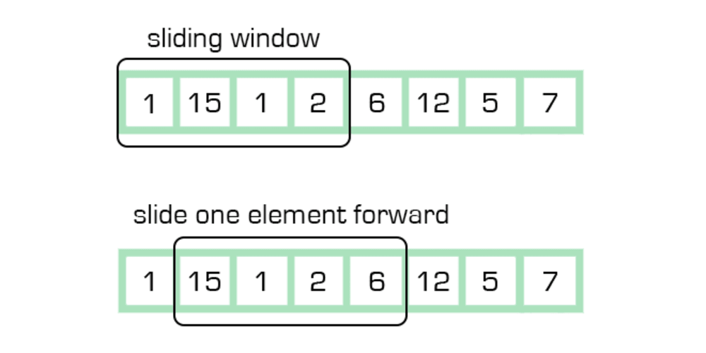

# Trendy
### Development Path
- Find correlations between cyclic events (triggers) and price changes patterns
  - Trigger first
    - Surprise trigger (e.g. school shootings)
    - Anticipated trigger (e.g. Olympics)
      1. List pivotal dates/times of events
      2. Set bar size (daily/hourly/...)
      3. Set relative pre and post event cutoff times (e.g. [-10 bars, 15 bars]), each set of bars is referred to as event timeline, in this case each event timeline has $10 + 1 + 15 = 26$ bars. (This project treats the latest event timeline as the most indicative of ground truth, and is always used as the reference to compare with other event timelines. This is referred to as the principal event timeline.)
      4. Since the market may lag in response to the event, set a max_offset (e.g. 2 bars) to account for this lag. When comparing between the principal event timeline and another event timeline, a sliding window is performed on the non-principal event timeline to find which window
      
      5. Select sets of securities
      6. For each security, get price data over the event timeline
      7. For each bar, calculate  $\delta\text{price}_j = \dfrac{\text{price}_j - \text{price}_{j-1}}{\text{price}_{j-1}}$. Result is an $i\times j$ matrix where $i$ is the number of dates listed in step 1, and $j$ is the number of bars in the event timeline plus $2 \times$ max_offset.
      8. Repeat steps 5 and 6 for the market index which represents the macro effects surrounding the security, subtract the security's $\delta\text{price}_j$ from that of the market index 
      9. For each security, perform similarity testing between different timelines (variance of $\delta$price)
         - **Assumption**: $\delta$price should occur on the same relative bar in all event timelines (if spike occurs on bar -2 for one event timeline, it should occur on all other event timelines)
         - Minimise mean squared error (MSE) with variable parameter being the column shift
         - Calculate MSE for row pairs [(0, 1), (0, 2), ..., (0, n)]
  - $\delta$price pattern first

### Variables
### Data Integrity Concerns
- Stock splits cause price changes? (ideally should not)
- Broker's definition of "end of day" for EOD prices (might be last traded price instead)